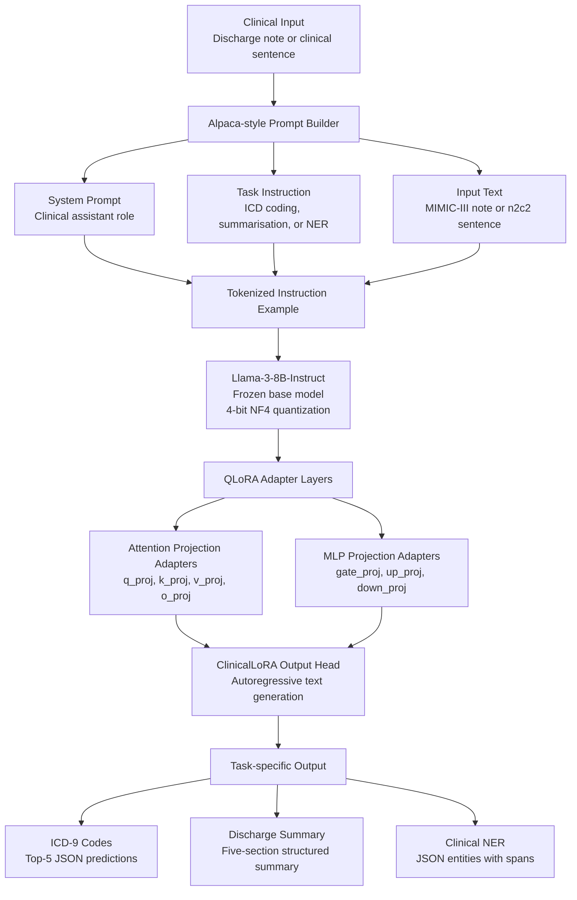

# ClinicalLoRA

[](https://python.org)
[](https://huggingface.co/meta-llama/Meta-Llama-3-8B-Instruct)
[](https://github.com/huggingface/peft)
[](LICENSE)
[](https://physionet.org/content/mimiciii/1.4/)

> **QLoRA fine-tuning of Llama-3-8B-Instruct on MIMIC-III discharge notes for three clinical NLP tasks: ICD-9 code prediction, discharge summarisation, and named entity recognition. Trains on a single A100 40 GB in under 3 hours. Adapter weights are ~40 MB.**

---

## What this project does

Large language models are powerful but general. This repo shows how to specialize Llama-3-8B for clinical text using parameter-efficient fine-tuning, specifically QLoRA, by adding only around 0.5% trainable parameters on top of the frozen base model.

The result is a model that understands clinical abbreviations, MIMIC note structure, and medical reasoning better than the base model.

Three tasks are supported, all through a single Alpaca-style instruction interface:

| Task | Input | Output |
|------|-------|--------|
| **ICD-9 coding** | Discharge note, up to 3,000 characters | JSON list of top-5 ICD-9 codes and descriptions |
| **Summarisation** | Full discharge note, up to 6,000 characters | Structured 5-section summary |
| **NER** | Single clinical sentence | JSON list of `{entity, type, span}` |

---

## Results

### ICD-9 Coding

**MIMIC-III, n = 4,823 test admissions**

| Model | Precision@5 | Recall@5 | Micro-F1 |
|-------|-------------|----------|----------|
| ClinicalBERT classifier | -- | -- | -- |
| Llama-3-8B zero-shot | -- | -- | -- |
| **ClinicalLoRA ours** | **--** | **--** | **--** |

### Summarisation

**MIMIC-III, n = ?? test notes**

| Model | ROUGE-1 | ROUGE-2 | ROUGE-L | BERTScore F1 |
|-------|---------|---------|---------|--------------|
| Llama-3-8B zero-shot | -- | -- | -- | -- |
| **ClinicalLoRA ours** | **--** | **--** | **--** | **--** |

### NER

**n2c2 2010, 500 test sentences**

| Entity type | Precision | Recall | F1 |
|-------------|-----------|--------|----|
| PROBLEM | -- | -- | -- |
| TREATMENT | -- | -- | -- |
| TEST | -- | -- | -- |
| **Overall** | **--** | **--** | **--** |

---

## Architecture

ClinicalLoRA uses a parameter-efficient QLoRA fine-tuning setup on top of a frozen Llama-3-8B-Instruct backbone. The base model is loaded in 4-bit NF4 precision, while a small set of LoRA adapter weights is trained on clinical instruction-response pairs.



### Model stack

| Component | Description |
|----------|-------------|
| **Base model** | `meta-llama/Meta-Llama-3-8B-Instruct` |
| **Training method** | QLoRA parameter-efficient supervised fine-tuning |
| **Quantization** | 4-bit NF4 quantization |
| **Base model status** | Frozen during training |
| **Trainable module** | LoRA adapters only |
| **Prompt format** | Alpaca-style clinical instruction format |
| **Supported tasks** | ICD-9 coding, discharge summarisation, clinical NER |

### LoRA configuration

| Hyperparameter | Value |
|---------------|-------|
| LoRA rank `r` | `16` |
| LoRA alpha | `32` |
| LoRA dropout | `0.05` |
| Target attention modules | `q_proj`, `k_proj`, `v_proj`, `o_proj` |
| Target MLP modules | `gate_proj`, `up_proj`, `down_proj` |
| Trainable parameters | approximately `21M` |
| Trainable fraction | approximately `0.5%` of the 8B base model |
| Adapter size | approximately `40 MB` |

### Adapter injection points

ClinicalLoRA injects LoRA adapters into both the self-attention and feed-forward blocks of the Llama-3 transformer.

```text
Llama-3 Transformer Block
│
├── Self-Attention
│   ├── q_proj  ← LoRA
│   ├── k_proj  ← LoRA
│   ├── v_proj  ← LoRA
│   └── o_proj  ← LoRA
│
├── MLP / SwiGLU
│   ├── gate_proj  ← LoRA
│   ├── up_proj    ← LoRA
│   └── down_proj  ← LoRA
│
└── Frozen base parameters
```

This design keeps the original Llama-3-8B-Instruct weights unchanged while allowing the adapter layers to specialize the model for clinical language, discharge-note structure, ICD-9 coding patterns, and entity-level clinical extraction.

### Prompt format

All tasks use the same instruction-style format. Only the task instruction and expected response format change.

```text
### System:
You are a clinical NLP assistant trained to understand discharge notes,
medical abbreviations, diagnoses, procedures, and clinical entities.

### Instruction:
{task-specific instruction}

### Input:
{clinical note or sentence}

### Response:
{target clinical output}
```

### Task-specific outputs

| Task | Input | Model output |
|------|-------|--------------|
| **ICD-9 coding** | Discharge note | JSON list of top-5 ICD-9 codes with descriptions |
| **Discharge summarisation** | Full discharge note | Five-section structured clinical summary |
| **Clinical NER** | Single clinical sentence | JSON list of entities, entity types, and character spans |

### Training objective

During supervised fine-tuning, the model is trained only to generate the response portion of the prompt. Instruction and input tokens are masked from the loss using `labels = -100`.

```text
Prompt tokens:    ignored during loss computation
Response tokens:  used for language modeling loss
```

This prevents the model from learning to copy the prompt and focuses training on producing clinically useful structured outputs.
### Why QLoRA over full fine-tuning?

Full fine-tuning of an 8B model requires around 80 GB VRAM and produces a checkpoint of around 16 GB.

QLoRA fine-tuning requires around 18 GB VRAM on a single A100 40 GB GPU, trains faster, and saves only the adapter weights, which are around 40 MB. This makes the model easier to share, store, and reuse across tasks without re-downloading the base model.

---

## Quickstart

### 1. Install

```bash
git clone https://github.com/YOUR_USERNAME/clinical-lora.git
cd clinical-lora

conda create -n clinical-lora python=3.10 -y
conda activate clinical-lora

pip install -r requirements.txt
```

Set your HuggingFace token. This is required for Llama-3 access.

```bash
export HF_TOKEN=hf_your_token_here
```

---

### 2. Get data

#### MIMIC-III

MIMIC-III requires PhysioNet credentialing.

```text
https://physionet.org/content/mimiciii/1.4/
```

Download the following files:

```text
NOTEEVENTS.csv
DIAGNOSES_ICD.csv
D_ICD_DIAGNOSES.csv
```

#### n2c2 2010

The n2c2 2010 dataset is used for the NER task and requires a data use agreement.

```text
https://portal.dbmi.hms.harvard.edu/projects/n2c2-nlp/
```

---

### 3. Train

```bash
# ICD-9 coding
python src/train.py \
    --task icd_coding \
    --mimic_root /data/mimic-iii

# Discharge summarisation
python src/train.py \
    --task summarization \
    --mimic_root /data/mimic-iii

# Clinical NER
python src/train.py \
    --task ner \
    --n2c2_root /data/n2c2
```

Approximate training time:

| Task | Time on 1× A100 40 GB |
|------|------------------------|
| ICD-9 coding | ~2.5 hours |
| Discharge summarisation | ~3 hours |
| Clinical NER | ~1 hour |

---

### 4. Evaluate

```bash
python src/evaluate.py \
    --task icd_coding \
    --adapter results/icd_coding/adapter \
    --mimic_root /data/mimic-iii \
    --n_samples 500 \
    --output results/icd_coding/eval.json
```

---

### 5. Run Inference

ClinicalLoRA supports both Python API inference and command-line inference. Each task uses the same model wrapper, with the task selected through the `task` argument.

> Example outputs below are illustrative. Actual predictions depend on the trained adapter checkpoint and decoding settings.

---

#### Python API

##### ICD-9 Coding

```python
from src.inference import ClinicalLoRA

model = ClinicalLoRA(
    adapter_path="results/icd_coding/adapter",
    task="icd_coding",
    load_in_4bit=True,
)

note = """
72-year-old male with a history of hypertension and type 2 diabetes admitted
with acute onset chest pain. EKG showed ST-elevation in leads II, III, aVF.
Troponin elevated at 4.2. Emergent cardiac catheterization performed,
drug-eluting stent placed in RCA. Patient stabilized on aspirin, clopidogrel,
metoprolol, lisinopril. Discharged day 5 in stable condition.
"""

predictions = model.predict(text=note)
print(predictions)
```

Expected output format:

```json
[
  {
    "code": "410.91",
    "description": "Acute myocardial infarction, unspecified site"
  },
  {
    "code": "414.01",
    "description": "Coronary atherosclerosis of native coronary artery"
  },
  {
    "code": "401.9",
    "description": "Unspecified essential hypertension"
  },
  {
    "code": "250.00",
    "description": "Type II diabetes mellitus without complication"
  },
  {
    "code": "36.06",
    "description": "Insertion of non-drug-eluting coronary artery stent"
  }
]
```

---

##### Discharge Summarisation

```python
from src.inference import ClinicalLoRA

model = ClinicalLoRA(
    adapter_path="results/summarization/adapter",
    task="summarization",
    load_in_4bit=True,
)

summary = model.predict(text=note)
print(summary)
```

Expected output format:

```text
1. Chief complaint:
   Acute chest pain with ST-elevation myocardial infarction.

2. Key findings:
   ST-elevation in leads II, III, and aVF with elevated troponin.

3. Diagnoses:
   Inferior STEMI, coronary artery disease, hypertension, and type 2 diabetes.

4. Procedures:
   Emergent cardiac catheterization with stent placement to the RCA.

5. Discharge condition and follow-up:
   Discharged in stable condition on dual antiplatelet therapy with cardiology follow-up.
```

---

##### Clinical Named Entity Recognition

```python
from src.inference import ClinicalLoRA

model = ClinicalLoRA(
    adapter_path="results/ner/adapter",
    task="ner",
    load_in_4bit=True,
)

sentence = "Patient has chronic kidney disease and is on hemodialysis."

entities = model.predict(sentence=sentence)
print(entities)
```

Expected output format:

```json
[
  {
    "entity": "chronic kidney disease",
    "type": "PROBLEM",
    "span": [12, 34]
  },
  {
    "entity": "hemodialysis",
    "type": "TREATMENT",
    "span": [45, 57]
  }
]
```

---

#### Command-Line Interface

Single-example inference:

```bash
python src/inference.py \
    --task icd_coding \
    --adapter results/icd_coding/adapter \
    --input patient_note.txt
```

Summarisation inference:

```bash
python src/inference.py \
    --task summarization \
    --adapter results/summarization/adapter \
    --input discharge_note.txt
```

Clinical NER inference:

```bash
python src/inference.py \
    --task ner \
    --adapter results/ner/adapter \
    --input sentence.txt
```

Batch inference:

```bash
python src/inference.py \
    --task summarization \
    --adapter results/summarization/adapter \
    --batch notes.csv \
    --output predictions.json
```

---

#### Inference Options

| Argument | Description |
|---------|-------------|
| `--task` | Task name: `icd_coding`, `summarization`, or `ner` |
| `--adapter` | Path to the trained LoRA adapter checkpoint |
| `--input` | Path to a single text input file |
| `--batch` | Path to a CSV file for batch inference |
| `--output` | Path where predictions should be saved |
| `--load_in_4bit` | Load the model in 4-bit mode for lower VRAM usage |
| `--max_new_tokens` | Maximum number of tokens generated in the response |
| `--temperature` | Sampling temperature for generation |
| `--top_p` | Nucleus sampling parameter |

Recommended deterministic decoding for evaluation:

```bash
--temperature 0.0
```

Recommended generation setting for summarisation:

```bash
--max_new_tokens 512
```

---

## Input and Output Specification

ClinicalLoRA uses task-specific input and output schemas. ICD-9 coding and NER return structured JSON outputs, while summarisation returns a structured free-text summary.

---

### ICD-9 Coding

#### Input

| Field | Type | Description |
|------|------|-------------|
| `text` | `str` | Discharge note text |
| Maximum length | `3,000 characters` | Longer notes are truncated before prompting |

The model expects a discharge summary or discharge-note-like clinical document.

```text
72-year-old male with hypertension and type 2 diabetes admitted with chest pain...
```

#### Output

The model returns up to five ICD-9 predictions sorted by predicted relevance.

```json
[
  {
    "code": "410.91",
    "description": "Acute myocardial infarction, unspecified site"
  },
  {
    "code": "414.01",
    "description": "Coronary atherosclerosis of native coronary artery"
  }
]
```

Output schema:

| Field | Type | Description |
|------|------|-------------|
| `code` | `str` | ICD-9 diagnosis or procedure code |
| `description` | `str` | Human-readable ICD-9 description |

---

### Discharge Summarisation

#### Input

| Field | Type | Description |
|------|------|-------------|
| `text` | `str` | Full discharge note |
| Maximum length | `6,000 characters` | Longer notes are truncated before prompting |

#### Output

The model returns a five-section structured summary.

```text
1. Chief complaint:
   ...

2. Key findings:
   ...

3. Diagnoses:
   ...

4. Procedures:
   ...

5. Discharge condition and follow-up:
   ...
```

Required summary sections:

| Section | Description |
|--------|-------------|
| `Chief complaint` | Main reason for admission |
| `Key findings` | Important labs, imaging, vitals, or exam findings |
| `Diagnoses` | Main diagnoses described in the note |
| `Procedures` | Major procedures or interventions |
| `Discharge condition and follow-up` | Discharge status, medications, and follow-up plan |

---

### Clinical Named Entity Recognition

#### Input

| Field | Type | Description |
|------|------|-------------|
| `sentence` | `str` | A single clinical sentence |

NER is designed for sentence-level extraction rather than full-note extraction.

```text
Patient has chronic kidney disease and is on hemodialysis.
```

#### Output

The model returns a JSON list of extracted entities.

```json
[
  {
    "entity": "chronic kidney disease",
    "type": "PROBLEM",
    "span": [12, 34]
  },
  {
    "entity": "hemodialysis",
    "type": "TREATMENT",
    "span": [45, 57]
  }
]
```

Output schema:

| Field | Type | Description |
|------|------|-------------|
| `entity` | `str` | Exact entity text from the input sentence |
| `type` | `str` | Entity label: `PROBLEM`, `TREATMENT`, or `TEST` |
| `span` | `List[int]` | Character-level `[start, end]` span with exclusive end index |

---

## Project Structure

```text
clinical-lora/
├── src/
│   ├── dataset.py
│   │   ├── MIMIC-III discharge-note loading
│   │   ├── ICD-9 label construction
│   │   ├── n2c2 NER example formatting
│   │   └── Alpaca-style prompt templates
│   │
│   ├── train.py
│   │   ├── QLoRA model loading
│   │   ├── LoRA adapter configuration
│   │   ├── supervised fine-tuning loop
│   │   └── checkpoint saving
│   │
│   ├── inference.py
│   │   ├── ClinicalLoRA inference wrapper
│   │   ├── task-specific prompt construction
│   │   ├── single-example inference
│   │   └── batch inference CLI
│   │
│   ├── evaluate.py
│   │   ├── ICD-9 Precision@5 / Recall@5 / Micro-F1
│   │   ├── summarisation ROUGE / BERTScore
│   │   └── NER precision / recall / F1
│   │
│   └── merge.py
│       └── optional adapter merging into the base model
│
├── configs/
│   └── lora_config.yaml
│       ├── LoRA hyperparameters
│       ├── training arguments
│       └── generation settings
│
├── results/
│   ├── icd_coding/
│   ├── summarization/
│   └── ner/
│
├── requirements.txt
├── README.md
└── LICENSE
```

---

## Key Design Decisions

### Why Llama-3-8B-Instruct?

ClinicalLoRA uses `meta-llama/Meta-Llama-3-8B-Instruct` because it provides a strong instruction-following foundation while remaining practical for single-GPU QLoRA fine-tuning.

The instruction-tuned base model is useful for this project because all three tasks are naturally expressed as instruction-response problems:

- ICD-9 coding: generate structured code predictions from a discharge note
- Summarisation: generate a structured clinical summary
- NER: generate JSON-formatted entity spans

Using an instruction-tuned backbone also reduces the amount of task-specific engineering needed. The same prompt interface can be reused across all tasks.

---

### Why QLoRA?

Full fine-tuning of an 8B parameter model is expensive and memory intensive. QLoRA makes the training setup more practical by freezing the base model, loading it in 4-bit precision, and training only a small number of adapter parameters.

This has four practical advantages:

1. **Lower memory usage**  
   The base model is quantized to 4-bit NF4, reducing GPU memory requirements.

2. **Smaller checkpoints**  
   Only the LoRA adapter weights are saved, rather than a full copy of the model.

3. **Faster experimentation**  
   Different tasks can use separate adapters without retraining or duplicating the base model.

4. **Easier deployment**  
   The base model and adapter can be loaded together at inference time, or the adapter can be merged into the base model when needed.

---

### Why one prompt format for all tasks?

ClinicalLoRA uses a unified Alpaca-style prompt format across ICD-9 coding, summarisation, and NER.

This keeps the training and inference pipeline simple:

```text
### System:
{clinical assistant role}

### Instruction:
{task-specific instruction}

### Input:
{clinical text}

### Response:
{target output}
```

The model architecture does not change between tasks. Only the instruction text, input text, and expected output format change.

This design makes the repository easier to extend to additional clinical NLP tasks, such as:

- medication extraction
- problem-list generation
- procedure extraction
- discharge instruction generation
- phenotype classification as text generation

---

### Why supervised fine-tuning instead of classification heads?

ClinicalLoRA treats all tasks as text generation tasks rather than adding task-specific classification heads.

This design was chosen because the three supported tasks have different output structures:

| Task | Output type |
|------|-------------|
| ICD-9 coding | JSON list of codes and descriptions |
| Summarisation | Multi-section free-text summary |
| Clinical NER | JSON list of entities and spans |

A generative instruction-following format allows the same model interface to handle all three output types.

---

### Why token masking on the instruction?

During training, loss is computed only on the response tokens. The system prompt, instruction, and input text are included as context, but they are masked from the training loss using:

```python
labels = -100
```

This prevents the model from learning to copy the prompt and focuses optimization on generating the correct clinical output.

```text
System prompt:    ignored by loss
Instruction:      ignored by loss
Input text:       ignored by loss
Response:         included in loss
```

---

### Why silver-standard summaries?

MIMIC-III does not provide a separate human-written summarisation benchmark for every discharge note. However, discharge summaries often contain structured physician-written sections, such as hospital course, discharge diagnosis, procedures, and discharge instructions.

ClinicalLoRA uses these sections to construct silver-standard summarisation targets.

This approach makes the summarisation task scalable while still grounding the target summaries in clinically meaningful physician-authored text.

---

### Why structured JSON outputs?

ICD-9 coding and NER use JSON outputs because they are easier to evaluate, parse, and integrate into downstream pipelines.

For example, ICD-9 coding returns:

```json
[
  {
    "code": "401.9",
    "description": "Unspecified essential hypertension"
  }
]
```

NER returns:

```json
[
  {
    "entity": "hemodialysis",
    "type": "TREATMENT",
    "span": [45, 57]
  }
]
```

Structured generation makes the model output easier to validate than unrestricted free text.

---

### Why keep the base model frozen?

The base Llama-3-8B-Instruct weights are kept frozen during training. Only the LoRA adapter parameters are updated.

This reduces training cost and helps preserve the general instruction-following ability of the base model while allowing the adapter to specialize in clinical language and task-specific output formats.

---

### Why token masking on the instruction?

The training loss is computed only on the response tokens.

Instruction and input tokens are masked using:

```python
labels = -100
```

This prevents the model from simply learning to reproduce the prompt and focuses learning on generating the correct clinical output.

---

This project builds on:

- [Llama 3](https://ai.meta.com/blog/meta-llama-3/) — Meta AI, 2024
- [QLoRA](https://arxiv.org/abs/2305.14314) — Dettmers et al., 2023
- [MIMIC-III](https://doi.org/10.1038/sdata.2016.35) — Johnson et al., 2016
- [n2c2 2010](https://portal.dbmi.hms.harvard.edu/projects/n2c2-nlp/) — i2b2/VA Challenge
