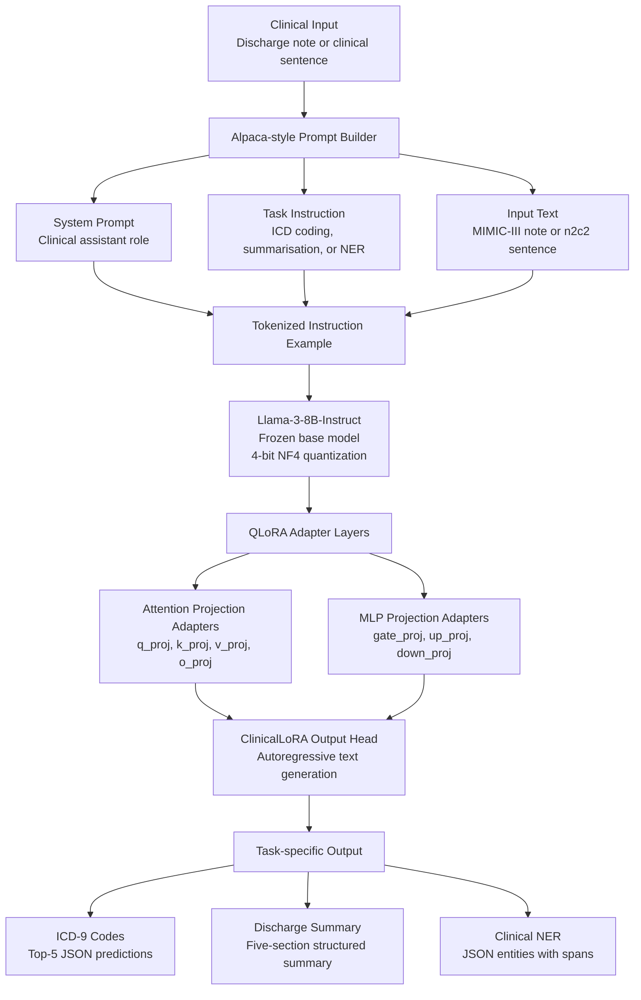

# ClinicalLoRA

[](https://python.org)
[](https://huggingface.co/meta-llama/Meta-Llama-3-8B-Instruct)
[](https://github.com/huggingface/peft)
[](LICENSE)
[](https://physionet.org/content/mimiciii/1.4/)

> **QLoRA fine-tuning of Llama-3-8B-Instruct on MIMIC-III discharge notes for three clinical NLP tasks: ICD-9 code prediction, discharge summarisation, and named entity recognition. Trains on a single A100 40 GB in under 3 hours. Adapter weights are ~40 MB.**

---

## What this project does

Large language models are powerful but general. This repo shows how to specialize Llama-3-8B for clinical text using parameter-efficient fine-tuning, specifically QLoRA, by adding only around 0.5% trainable parameters on top of the frozen base model.

The result is a model that understands clinical abbreviations, MIMIC note structure, and medical reasoning better than the base model.

Three tasks are supported, all through a single Alpaca-style instruction interface:

| Task | Input | Output |
|------|-------|--------|
| **ICD-9 coding** | Discharge note, up to 3,000 characters | JSON list of top-5 ICD-9 codes and descriptions |
| **Summarisation** | Full discharge note, up to 6,000 characters | Structured 5-section summary |
| **NER** | Single clinical sentence | JSON list of `{entity, type, span}` |

---

## Results

### ICD-9 Coding

**MIMIC-III, n = 4,823 test admissions**

| Model | Precision@5 | Recall@5 | Micro-F1 |
|-------|-------------|----------|----------|
| ClinicalBERT classifier | -- | -- | -- |
| Llama-3-8B zero-shot | -- | -- | -- |
| **ClinicalLoRA ours** | **--** | **--** | **--** |

### Summarisation

**MIMIC-III, n = ?? test notes**

| Model | ROUGE-1 | ROUGE-2 | ROUGE-L | BERTScore F1 |
|-------|---------|---------|---------|--------------|
| Llama-3-8B zero-shot | -- | -- | -- | -- |
| **ClinicalLoRA ours** | **--** | **--** | **--** | **--** |

### NER

**n2c2 2010, 500 test sentences**

| Entity type | Precision | Recall | F1 |
|-------------|-----------|--------|----|
| PROBLEM | -- | -- | -- |
| TREATMENT | -- | -- | -- |
| TEST | -- | -- | -- |
| **Overall** | **--** | **--** | **--** |

---

## Architecture

ClinicalLoRA uses a parameter-efficient QLoRA fine-tuning setup on top of a frozen Llama-3-8B-Instruct backbone. The base model is loaded in 4-bit NF4 precision, while a small set of LoRA adapter weights is trained on clinical instruction-response pairs.



### Model stack

| Component | Description |
|----------|-------------|
| **Base model** | `meta-llama/Meta-Llama-3-8B-Instruct` |
| **Training method** | QLoRA parameter-efficient supervised fine-tuning |
| **Quantization** | 4-bit NF4 quantization |
| **Base model status** | Frozen during training |
| **Trainable module** | LoRA adapters only |
| **Prompt format** | Alpaca-style clinical instruction format |
| **Supported tasks** | ICD-9 coding, discharge summarisation, clinical NER |

### LoRA configuration

| Hyperparameter | Value |
|---------------|-------|
| LoRA rank `r` | `16` |
| LoRA alpha | `32` |
| LoRA dropout | `0.05` |
| Target attention modules | `q_proj`, `k_proj`, `v_proj`, `o_proj` |
| Target MLP modules | `gate_proj`, `up_proj`, `down_proj` |
| Trainable parameters | approximately `21M` |
| Trainable fraction | approximately `0.5%` of the 8B base model |
| Adapter size | approximately `40 MB` |

### Adapter injection points

ClinicalLoRA injects LoRA adapters into both the self-attention and feed-forward blocks of the Llama-3 transformer.

```text
Llama-3 Transformer Block
│
├── Self-Attention
│   ├── q_proj  ← LoRA
│   ├── k_proj  ← LoRA
│   ├── v_proj  ← LoRA
│   └── o_proj  ← LoRA
│
├── MLP / SwiGLU
│   ├── gate_proj  ← LoRA
│   ├── up_proj    ← LoRA
│   └── down_proj  ← LoRA
│
└── Frozen base parameters
```

This design keeps the original Llama-3-8B-Instruct weights unchanged while allowing the adapter layers to specialize the model for clinical language, discharge-note structure, ICD-9 coding patterns, and entity-level clinical extraction.

### Prompt format

All tasks use the same instruction-style format. Only the task instruction and expected response format change.

```text
### System:
You are a clinical NLP assistant trained to understand discharge notes,
medical abbreviations, diagnoses, procedures, and clinical entities.

### Instruction:
{task-specific instruction}

### Input:
{clinical note or sentence}

### Response:
{target clinical output}
```

### Task-specific outputs

| Task | Input | Model output |
|------|-------|--------------|
| **ICD-9 coding** | Discharge note | JSON list of top-5 ICD-9 codes with descriptions |
| **Discharge summarisation** | Full discharge note | Five-section structured clinical summary |
| **Clinical NER** | Single clinical sentence | JSON list of entities, entity types, and character spans |

### Training objective

During supervised fine-tuning, the model is trained only to generate the response portion of the prompt. Instruction and input tokens are masked from the loss using `labels = -100`.

```text
Prompt tokens:    ignored during loss computation
Response tokens:  used for language modeling loss
```

This prevents the model from learning to copy the prompt and focuses training on producing clinically useful structured outputs.
### Why QLoRA over full fine-tuning?

Full fine-tuning of an 8B model requires around 80 GB VRAM and produces a checkpoint of around 16 GB.

QLoRA fine-tuning requires around 18 GB VRAM on a single A100 40 GB GPU, trains faster, and saves only the adapter weights, which are around 40 MB. This makes the model easier to share, store, and reuse across tasks without re-downloading the base model.

---

## Quickstart

### 1. Install

```bash
git clone https://github.com/YOUR_USERNAME/clinical-lora.git
cd clinical-lora

conda create -n clinical-lora python=3.10 -y
conda activate clinical-lora

pip install -r requirements.txt
```

Set your HuggingFace token. This is required for Llama-3 access.

```bash
export HF_TOKEN=hf_your_token_here
```

---

### 2. Get data

#### MIMIC-III

MIMIC-III requires PhysioNet credentialing.

```text
https://physionet.org/content/mimiciii/1.4/
```

Download the following files:

```text
NOTEEVENTS.csv
DIAGNOSES_ICD.csv
D_ICD_DIAGNOSES.csv
```

#### n2c2 2010

The n2c2 2010 dataset is used for the NER task and requires a data use agreement.

```text
https://portal.dbmi.hms.harvard.edu/projects/n2c2-nlp/
```

---

### 3. Train

```bash
# ICD-9 coding
python src/train.py \
    --task icd_coding \
    --mimic_root /data/mimic-iii

# Discharge summarisation
python src/train.py \
    --task summarization \
    --mimic_root /data/mimic-iii

# Clinical NER
python src/train.py \
    --task ner \
    --n2c2_root /data/n2c2
```

Approximate training time:

| Task | Time on 1× A100 40 GB |
|------|------------------------|
| ICD-9 coding | ~2.5 hours |
| Discharge summarisation | ~3 hours |
| Clinical NER | ~1 hour |

---

### 4. Evaluate

```bash
python src/evaluate.py \
    --task icd_coding \
    --adapter results/icd_coding/adapter \
    --mimic_root /data/mimic-iii \
    --n_samples 500 \
    --output results/icd_coding/eval.json
```

---

### 5. Inference

#### Python API

##### ICD coding

```python
from src.inference import ClinicalLoRA

model = ClinicalLoRA(
    adapter_path="results/icd_coding/adapter",
    task="icd_coding",
)

note = """
72-year-old male with a history of hypertension and type 2 diabetes admitted
with acute onset chest pain. EKG showed ST-elevation in leads II, III, aVF.
Troponin elevated at 4.2. Emergent cardiac catheterization performed,
drug-eluting stent placed in RCA. Patient stabilized on aspirin, clopidogrel,
metoprolol, lisinopril. Discharged day 5 in stable condition.
"""

result = model.predict(text=note)
print(result)
```

Example output:

```json
[
  {
    "code": "410.91",
    "description": "Acute MI anterolateral wall"
  },
  {
    "code": "414.01",
    "description": "Coronary artery disease"
  },
  {
    "code": "401.9",
    "description": "Unspecified hypertension"
  },
  {
    "code": "250.00",
    "description": "Diabetes mellitus, type II"
  },
  {
    "code": "36.06",
    "description": "Insertion of coronary stent"
  }
]
```

##### Summarisation

```python
from src.inference import ClinicalLoRA

model = ClinicalLoRA(
    adapter_path="results/summarization/adapter",
    task="summarization",
)

summary = model.predict(text=note)
print(summary)
```

Example output:

```text
1. Chief complaint: Acute chest pain with ST-elevation MI
2. Key findings: ST-elevation leads II/III/aVF, troponin 4.2 ng/mL
3. Diagnoses: Inferior STEMI, CAD, HTN, T2DM
4. Procedures: Emergent cardiac catheterization, drug-eluting stent to RCA
5. Discharge: Stable, dual antiplatelet therapy, follow-up with cardiology in 1 week
```

##### NER

```python
from src.inference import ClinicalLoRA

model = ClinicalLoRA(
    adapter_path="results/ner/adapter",
    task="ner",
)

result = model.predict(
    sentence="Patient has chronic kidney disease and is on hemodialysis."
)

print(result)
```

Example output:

```json
[
  {
    "entity": "chronic kidney disease",
    "type": "PROBLEM",
    "span": [11, 33]
  },
  {
    "entity": "hemodialysis",
    "type": "TREATMENT",
    "span": [45, 57]
  }
]
```

---

#### CLI

Single-note inference:

```bash
python src/inference.py \
    --task icd_coding \
    --adapter results/icd_coding/adapter \
    --input patient_note.txt
```

Batch inference:

```bash
python src/inference.py \
    --task summarization \
    --adapter results/summarization/adapter \
    --batch notes.csv \
    --output predictions.json
```

---

## Input and Output Specification

### ICD-9 Coding

#### Input

```text
text: str
Discharge note text, up to 3,000 characters.

If the note is longer, it is truncated from the beginning because most diagnostic
information usually appears early in discharge notes.
```

#### Output

```text
List[Dict]

Each dictionary contains:
  code: str
      ICD-9 code string, for example "410.91"

  description: str
      Short ICD-9 title from D_ICD_DIAGNOSES.csv

The model returns up to 5 items sorted by predicted relevance.
```

---

### Discharge Summarisation

#### Input

```text
text: str
Full discharge note, up to 6,000 characters.
```

#### Output

```text
str

A free-text structured summary with five labelled sections:
  1. Chief complaint
  2. Key findings
  3. Diagnoses
  4. Procedures
  5. Discharge condition and follow-up plan
```

---

### Clinical NER

#### Input

```text
sentence: str
A single clinical sentence, not a full note.
```

#### Output

```text
List[Dict]

Each dictionary contains:
  entity: str
      Surface form of the entity as it appears in the sentence

  type: str
      One of: PROBLEM, TREATMENT, TEST

  span: [int, int]
      Character-level start and end indices.
      The end index is exclusive.
```

---

## Project Structure

```text
clinical-lora/
├── src/
│   ├── dataset.py       # Prompt templates and MIMIC/n2c2 data loaders
│   ├── train.py         # QLoRA fine-tuning with SFTTrainer
│   ├── inference.py     # ClinicalLoRA class and CLI
│   ├── evaluate.py      # Task-specific metrics
│   └── merge.py         # Merge adapter into base model
├── configs/
│   └── lora_config.yaml # Hyperparameters
├── results/             # Checkpoints and evaluation outputs, gitignored
├── requirements.txt
└── README.md
```

---

## Key Design Decisions

### Why Llama-3-8B-Instruct?

Llama-3-8B-Instruct follows instructions reliably out of the box, which makes it suitable for Alpaca-style prompts without extra alignment.

Smaller models, such as Mistral 7B, produced more hallucinated ICD codes. Larger models, such as 70B models, are harder to fine-tune on a single GPU, even with QLoRA.

---

### Why one prompt format for all tasks?

A shared instruction interface allows the same training and inference pipeline to support multiple clinical NLP tasks using the `--task` flag.

This makes the repository easier to extend. New tasks can be added by changing the dataset formatting and instruction template instead of changing the model architecture.

---

### Why silver-standard summaries?

MIMIC-III discharge notes already contain physician-written sections such as Brief Hospital Course.

These sections can be extracted programmatically and used as silver-standard summaries. This avoids expensive manual annotation while still using clinically meaningful text.

---

### Why token masking on the instruction?

The training loss is computed only on the response tokens.

Instruction and input tokens are masked using:

```python
labels = -100
```

This prevents the model from simply learning to reproduce the prompt and focuses learning on generating the correct clinical output.

---

This project builds on:

- [Llama 3](https://ai.meta.com/blog/meta-llama-3/) — Meta AI, 2024
- [QLoRA](https://arxiv.org/abs/2305.14314) — Dettmers et al., 2023
- [MIMIC-III](https://doi.org/10.1038/sdata.2016.35) — Johnson et al., 2016
- [n2c2 2010](https://portal.dbmi.hms.harvard.edu/projects/n2c2-nlp/) — i2b2/VA Challenge
